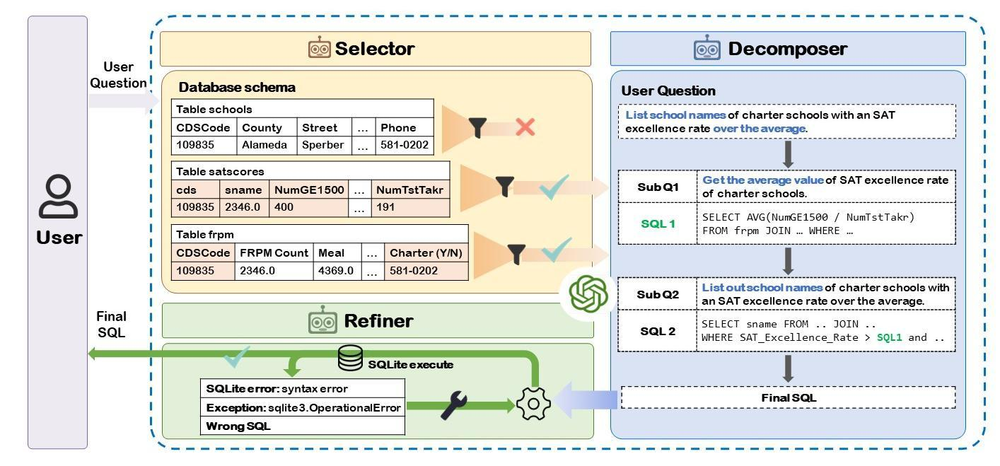

## 📖Introduction

This is the official repository for the paper ["MAC-SQL: A Multi-Agent Collaborative Framework for Text-to-SQL"](https://arxiv.org/abs/2312.11242).

In this paper, we propose a multi-agent collaborative Text-to-SQL framework MAC-SQL, which comprises three agents: the **Selector**, the **Decomposer**, and the **Refiner**.




# 🔥 Updates
- [**2024-11-30**] Our work has been accepted by <span style="color: red;">COLING 2025</span> [conference paper version](https://aclanthology.org/2025.coling-main.36/). Welcome to cite this paper version.
- [**2024-04-23**] We have updated the `sql-llama-instruct-v0.5.jsonl` and training scripts in `training_scripts` dir of this project. Please check it out.Download the `sql-llama-data.zip` from [Baidu Dsik](https://pan.baidu.com/s/1yaEBsSN894O7MlBrckciKw?pwd=htwt) or [Google Drive](https://drive.google.com/file/d/1_3s88Op1PCZo50RsHcx5m2Bj_n05PPn4/view?usp=sharing).
Unzip `sql-llama-data.zip` and get the data dir, which contains sql-llama-instruct-v0.5.jsonl (3375 instances).
- [**2024-04-22**] We have updated the [SQL-Llama-v0.5](https://huggingface.co/IceKingBing) model and data.zip (update dev_gold_schema.json in bird and spider) The download links of the updated data are available on [Baidu Disk](https://pan.baidu.com/s/1jU2li3d-enhzswx8VdNYdg?pwd=hfmk) and [Google Drive](https://drive.google.com/file/d/1kkkNJSmJkZKeZyDFUDG7c4mnkxsrr-om/view?usp=sharing).
- [**2024-02-18**] We have updated the paper, with updates mainly focusing on experiments and framework details, check it out! [link](https://arxiv.org/abs/2312.11242).
- [**2023-12-26**] We have updated the paper, with updates mainly focusing on the title, abstract, introduction, some details, and appendix. In addition, we give some bad case examples on `bad_cases` folder, check it out!
- [**2023-12-19**] We released our first version [paper](https://arxiv.org/abs/2312.11242), [code](https://github.com/wbbeyourself/MAC-SQL). Check it out!


## ⚡Environment

1. Config your local environment.

```bash
conda create -n macsql python=3.9 -y
conda activate macsql
pip install -r requirements.txt
python -c "import nltk; nltk.download('punkt')"
```

Note: we use `openai==0.28.1`, which use `openai.ChatCompletion.create` to call api.

2. Edit openai config at **core/api_config.py**, and set related environment variables of Azure OpenAI API.

Currently, we use `gpt-4-1106-preview` (128k version) by default, which is 2.5 times less expensive than the `gpt-4 (8k)` on average.

```bash
export OPENAI_API_BASE="YOUR_OPENAI_API_BASE"
export OPENAI_API_KEY="YOUR_OPENAI_API_KEY"
```

## 🔧 Data Preparation

In order to prepare the data more quickly, I have packaged the files including the databases of the BIRD dataset and the Spider dataset into `data.zip` and uploaded them. 
All files were downloaded on December 19, 2023, ensuring they are the latest version at that moment. 
The download links are available on [Baidu Disk](https://pan.baidu.com/s/1jU2li3d-enhzswx8VdNYdg?pwd=hfmk) and [Google Drive](https://drive.google.com/file/d/1kkkNJSmJkZKeZyDFUDG7c4mnkxsrr-om/view?usp=sharing)(update on 2024-04-22).

After downloading the `data.zip` file, you should delete the existing data folder in the project directory and replace it with the unzipped data folder from `data.zip`.


## 🚀 Run

The run script will first run 5 examples in Spider to check environment.
You should open code comments for different usage.

- `run.sh` for Linux/Mac OS
- `run.bat` for Windows OS

For SQL execution demo, you can use `app_bird.py` or `app_spider.py` to get the execution result of your SQL query.

```bash
cd ./scripts
python app_bird.py
python app_spider.py
```

If occur error `/bin/bash^M: bad interpreter` in Linux, use `sed -i -e 's/\r$//' run.sh` to solve it.

## 📝Evaluation Dataset

We evaluate our method on both BIRD dataset and Spider dataset.

EX: Execution Accuracy(%)

VES: Valid Efficiency Score(%)

Refer to our paper for the details.


## 🫡Run SQL-Llama

Download the [SQL-Llama](https://huggingface.co/IceKingBing)(current v0.5 version) and follow the [SQL-Llama-deployment.md](SQL-Llama-deployment.md) to deploy.

Uncomment the `MODEL_NAME = 'CodeLlama-7b-hf'` in `core/api_config.py` to set the global model and comment other `MODEL_NAME = xxx` lines.

Uncomment the `export OPENAI_API_BASE='http://0.0.0.0:8000/v1'` in `run.sh` to set the local model api base.

Then, run `run.sh` to start your local inference.


## 🌟 Project Structure

```txt
├─data # store datasets and databases
|  ├─spider
|  ├─bird
├─core
|  ├─agents.py       # define three agents class
|  ├─api_config.py   # OpenAI API ENV config
|  ├─chat_manager.py # manage the communication between agents
|  ├─const.py        # prompt templates and CONST values
|  ├─llm.py          # api call function and log print
|  ├─utils.py        # utils function
├─scripts            # sqlite execution flask demo
|  ├─app_bird.py
|  ├─app_spider.py
|  ├─templates
├─evaluation # evaluation scripts
|  ├─evaluation_bird_ex.py
|  ├─evaluation_bird_ves.py
|  ├─evaluation_spider.py
├─bad_cases
|  ├─badcase_BIRD(dev)_examples.xlsx
|  └badcase_Spider(dev)_examples.xlsx
├─evaluation_bird_ex_ves.sh # bird evaluation script
├─README.md
├─requirements.txt
├─run.py # main run script
├─run.sh # generation and evaluation script
```


## 💬Citation


If you find our work is helpful, please cite as:

```text
@inproceedings{macsql-2025,
  title={MAC-SQL: A Multi-Agent Collaborative Framework for Text-to-SQL},
  author={Wang, Bing and Ren, Changyu and Yang, Jian and Liang, Xinnian and Bai, Jiaqi and Chai, Linzheng and Yan, Zhao and Zhang, Qian-Wen and Yin, Di and Sun, Xing and others},
  booktitle={Proceedings of the 31st International Conference on Computational Linguistics},
  pages={540--557},
  year={2025}
}
```

## 👍Contributing


We welcome contributions and suggestions!
